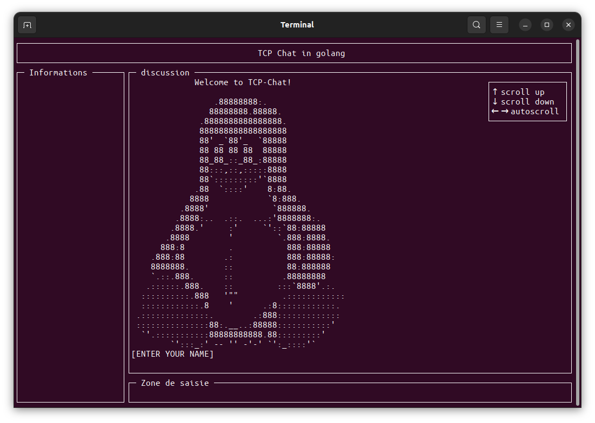

# Net Cat (TCP Chat)

### Descriptif
_______
TCP Chat est diviser en 2 partie, un serveur et un client.<br>
__1- Dossier serveur :__
Il permet de générer un serveur en écoute qui attend que des clients se connecte en communication TCP.

__2- Dossier client :__
C'est un client personnalisé qui permet de se connecter au serveur via une communication TCP est ainsi communiqué avec les autres clients qui sont connectés au serveur. La communication s'effectue via l'intermédiaire d'un terminal qui avec une option peut être customisé graphiquement.




### Usage
______
Installation :<br>
```go
git clone https://zone01normandie.org/git/folivier/net-cat.git
```

__Serveur__ (dans le dossier serveur) :<br>
le port est optionnel, par defaut le port `8989` sera utilisé s'il n'ai pas défini par l'utilisateur
```go
go run . <port>
```

__Client__ (dans le dossier client) :<br>
**l'ip serveur** ainsi que le **port** sont **obligatoire** afin que le client sache à quel serveur établir la connexion.<br>
L'option `-i` permet de généré une interface graphique personnalisé via [GOCUI](https://github.com/jroimartin/gocui)
```go
go run . <ip serveur> <port> -i
```

### Dépendence
_______
Le serveur est en Go version 1.20. N'utilise que la bibliothèque standard<br>
Le client est en Go version 1.20. Utilise les bibliothèques standard ainsi que [GOCUI](https://github.com/jroimartin/gocui)

### Authors
_______
+ Fabien Olivier
+ Antoine Salaun
+ Alexandre Valin
